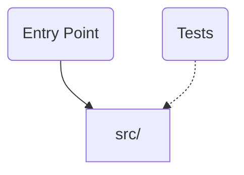

# ci-pipeline-service — Microservice with CI/CD pipeline

## Architecture


### Directory Structure
- `src/` (1 files)
- `tests/` (1 files)

## Stack
Node.js, TypeScript

## Stack-Specific Guidelines

### TypeScript
- Use `interface` for object shapes, `type` for unions/intersections
- Enable strict mode in tsconfig.json
- Avoid `any` — use `unknown` and narrow with type guards
- Prefer `as const` assertions over enum when practical
- Export types alongside their implementations

## TypeScript Configuration
- Strict mode: **enabled**
- Always fix type errors before committing — do not use `@ts-ignore`
- Run type checking: `npm run typecheck`

## Key Dependencies
- Use Zod for all input validation and type inference (z.infer<typeof schema>)
- Define schemas in a shared location. Use .parse() at API boundaries
- Use Vitest for testing. Colocate test files with source (*.test.ts)

## Build & Test
```bash
npm start            # node dist/index.js
npm run build        # tsc
npm test             # vitest run
npm run lint         # eslint src/
npm run typecheck    # tsc --noEmit
```

## Code Style
- Follow existing patterns in the codebase
- Write tests for new features
- Keep functions small and focused (< 50 lines)
- Use descriptive variable names; avoid abbreviations

<constraints>
- Never commit secrets, API keys, or .env files
- Always run tests before marking work complete
- Prefer editing existing files over creating new ones
- When uncertain about architecture, ask before implementing
- Do not use @ts-ignore or @ts-expect-error without a tracking issue
- Use const by default; never use var
</constraints>

<verification>
Before completing any task, confirm:
1. All existing tests still pass
2. New code has test coverage
3. No linting errors (`npm run lint`)
4. Build succeeds (`npm run build`)
5. No TypeScript errors (`npm run typecheck`)
6. Changes match the requested scope (no gold-plating)
</verification>

## Context Management
- Use /compact when context gets large (above 50% capacity)
- Prefer focused sessions — one task per conversation
- If a session gets too long, start fresh with /clear
- Use subagents for research tasks to keep main context clean

## Workflow
- Verify changes with tests before committing
- Use descriptive commit messages (why, not what)
- Create focused PRs — one concern per PR
- Document non-obvious decisions in code comments

---
*Generated by [nerviq-cli](https://github.com/DnaFin/nerviq-cli) v1.6.0 on 2026-03-31. Customize this file for your project — a hand-crafted CLAUDE.md will always be better than a generated one.*
