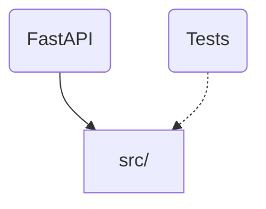

# p16

## Architecture


### Directory Structure
- `src/` (3 files)
- `tests/` (1 files)

## Stack
Python, FastAPI

## Stack-Specific Guidelines

### FastAPI
- Use Pydantic models for request/response validation
- Use dependency injection for shared logic
- Keep route handlers thin; delegate to service functions
- Use async def for I/O-bound endpoints

### Python
- Use type hints on all function signatures and return types
- Follow PEP 8; use f-strings for formatting
- Prefer pathlib over os.path
- Use dataclasses or pydantic for structured data
- Raise specific exceptions; never bare `except:`

## Key Dependencies
- Use Pydantic for data validation and serialization
- Use pytest for testing. Run with `python -m pytest`
- Use LangChain for chain/agent orchestration. Define chains in chains/ directory
- OpenAI SDK available. Use structured outputs where possible
- Anthropic SDK available. Prefer Claude for complex reasoning tasks
- Use ChromaDB for local vector storage. Persist collections to disk

## Build & Test
```bash
python -m pytest     # run tests
python -m mypy .     # type checking
ruff check .         # lint
```

## Code Style
- Follow existing patterns in the codebase
- Write tests for new features
- Keep functions small and focused (< 50 lines)
- Use descriptive variable names; avoid abbreviations

<constraints>
- Never commit secrets, API keys, or .env files
- Always run tests before marking work complete
- Prefer editing existing files over creating new ones
- When uncertain about architecture, ask before implementing
</constraints>

<verification>
Before completing any task, confirm:
1. All existing tests still pass
2. New code has test coverage
3. No linting errors (`ruff check .`)
4. Changes match the requested scope (no gold-plating)
</verification>

## Context Management
- Use /compact when context gets large (above 50% capacity)
- Prefer focused sessions — one task per conversation
- If a session gets too long, start fresh with /clear
- Use subagents for research tasks to keep main context clean

## Workflow
- Verify changes with tests before committing
- Use descriptive commit messages (why, not what)
- Create focused PRs — one concern per PR
- Document non-obvious decisions in code comments

---
*Generated by [nerviq-cli](https://github.com/DnaFin/nerviq-cli) v1.6.0 on 2026-03-31. Customize this file for your project — a hand-crafted CLAUDE.md will always be better than a generated one.*
